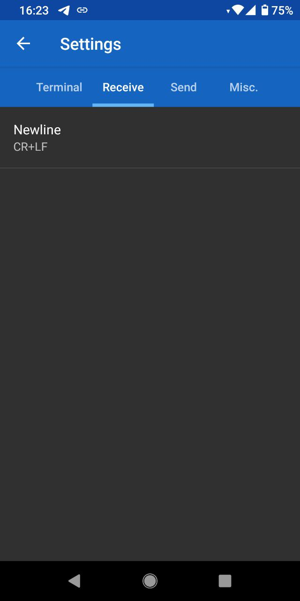
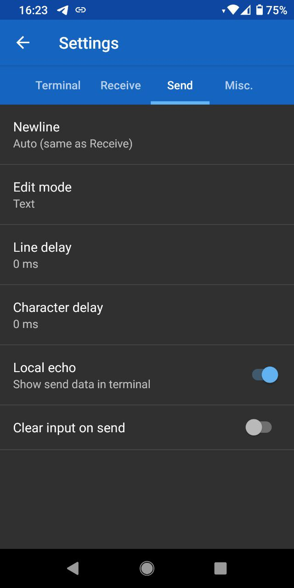

Android
=======

Serial Bluetooth Terminal




gnu/linux
=========

Add user to dialout group

```
usermod -a -G dialout zital
```

arduino-cli
===========

1. Install
```
su
cd /tmp
curl -fsSL https://raw.githubusercontent.com/arduino/arduino-cli/master/install.sh
```

Edit install.sh and replace:
```
DEFAULT_BINDIR="$PWD/bin"
```

by
```
DEFAULT_BINDIR="/usr/local/bin"
```

2. Get port list

```
arduino-cli board list
```

Output example:
```
Port         Protocol Type    Board Name FQBN Core
/dev/ttyS0   serial   Unknown                
/dev/ttyUSB0 serial   Unknown                
```

3. Upload sketch

```
arduino-cli upload -p /dev/ttyUSB0 --fqbn esp32:esp32:esp32-poe-iso EXAMPLE.ino
```